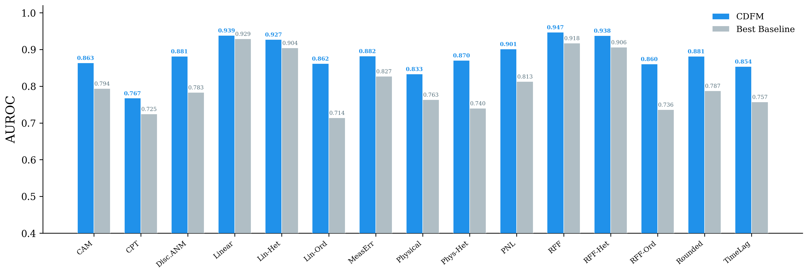

<p align="center">
  <a href="https://arxiv.org/abs/2607.11508"></a>
  <a href="https://huggingface.co/DMIRLAB/CDFM"></a>
  <a href="https://github.com/DMIRLAB-Group/CDFM"></a>
  
  
</p>

# CDFM: Towards a General-Purpose Causal Discovery Foundation Model

Causal Discovery Foundation Model (CDFM) is a pretrained foundation model for zero-shot causal discovery. Given purely observational data `X (N, D)`, it predicts the causal graph `G (D, D)` in a single forward pass.

CDFM reframes causal discovery as a unified, general-purpose framework for zero-shot structural inference. By pretraining on a massive, highly diverse space of synthetic structural causal models, CDFM successfully internalizes complex statistical asymmetries.

<p align="center">
  
</p>

- **State-of-the-art accuracy.** Outperforms all baselines across 15 mechanism families and on real-world benchmarks.
- **Zero-shot.** One pretrained checkpoint works for any N, any D.
- **Easy to use.** pip-installable, single `model.predict(data)` call.

---

## Installation

```bash
pip install cdfm-base
```

Requirements: `torch>=2.0`, `numpy>=1.20`, `safetensors`, `networkx`, `huggingface_hub`.

---

## Usage

### 1. Causal Discovery

The simplest way to use CDFM is to load the model and pass your observational data directly. By default, CDFM automatically calibrates the threshold for edge prediction.

```python
from cdfm import CDFM
from cdfm.utils import evaluate_graph, edge_auroc
import numpy as np

# Load from HuggingFace Hub
model = CDFM.from_pretrained("DMIRLAB/CDFM")

# Load a simple 4-variable nonlinear example (RFF mechanisms)
data = np.loadtxt("tests/data/simple/data.csv", delimiter=",")
gt = np.loadtxt("tests/data/simple/adjacency.csv", delimiter=",").astype(np.int32)

# 1. Standard Prediction (Auto-calibrated threshold)
result = model.predict(data) 
# 2. Manual Threshold Control
result_manual = model.predict(data, threshold=0.5)

print(result.adjacency) # (D, D) binary causal graph
metrics = evaluate_graph(result.adjacency, gt)
auc = edge_auroc(result.logits, gt)

print(f"F1={metrics['f1']:.4f}  SHD={metrics['shd']}  AUC={auc:.4f}")
# → F1=1.0000  SHD=0  AUC=1.0000
```

### 2. Missing value imputation

CDFM has a built-in imputation head trained with quantile loss. Call `model.imputation(data)` to fill missing values automatically:

```python
from cdfm import CDFM
import numpy as np

model = CDFM.from_pretrained("DMIRLAB/CDFM")

# Load data and create missing values (seed for reproducibility)
rng = np.random.default_rng(42)
data = np.loadtxt("tests/data/simple/data.csv", delimiter=",")
data_with_nan = data.copy()
data_with_nan[rng.random(data.shape) < 0.2] = np.nan

# CDFM imputation — auto-detects NaN
imputed = model.imputation(data_with_nan)

# Compare with mean imputation
mean_imp = data_with_nan.copy()
for j in range(data.shape[1]):
    col = data_with_nan[~np.isnan(data_with_nan[:, j]), j]
    mean_imp[np.isnan(mean_imp[:, j]), j] = col.mean()

missing = np.isnan(data_with_nan)
mae_cdfm = np.abs(imputed[missing] - data[missing]).mean()
mae_mean = np.abs(mean_imp[missing] - data[missing]).mean()
print(f"CDFM MAE: {mae_cdfm:.4f}  |  Mean MAE: {mae_mean:.4f}")
# → CDFM MAE: 0.3719  |  Mean MAE: 0.7817
```
---


## API Reference

### `CDFM` Class

```python
class CDFM:
    @classmethod
    def from_pretrained(
        cls,
        pretrained_model_name_or_path: str = "DMIRLAB/CDFM",   # HF Hub or local path
        device: str = "auto",                                  # auto / cpu / cuda:N
        threshold: float | None = None,                        # None = auto-calibrate
    ) -> "CDFM"

    def predict(
        self,
        data: np.ndarray,                     # (N, D) float32
        threshold: float | None = None,       # Probability threshold
        standardize: bool = True,             # Apply z-score standardization
        missing_mask: np.ndarray | None = None, 
    ) -> CDFMResult
```

### `CDFMResult` Object

```python
@dataclass
class CDFMResult:
    logits: np.ndarray           # (D, D) raw edge scores
    probabilities: np.ndarray    # (D, D) sigmoid(logits)
    adjacency: np.ndarray | None # (D, D) binary graph
    threshold: float | None      # Threshold value used
    runtime_sec: float           # Wall-clock time
```

---

## Links

- [Paper (arXiv)](https://arxiv.org/abs/2607.11508)
- [HuggingFace Model](https://huggingface.co/DMIRLAB/CDFM)
- [GitHub Repository](https://github.com/DMIRLAB-Group/CDFM)

## License

This project is licensed under [Apache 2.0](https://www.apache.org/licenses/LICENSE-2.0).

## Citation

If you use CDFM in your research, please cite:

```bibtex
@article{qiao2026cdfm,
  title   = {{CDFM}: Towards a General-Purpose Causal Discovery Foundation Model},
  author  = {Jie Qiao and Ruichu Cai and Zijian Li and Weilin Chen and
             Pengfei Hua and Boyan Xu and Zhengming Chen and Zhifeng Hao and
             Peng Cui},
  journal = {arXiv preprint arXiv:2607.11508},
  year    = {2026},
}
```
